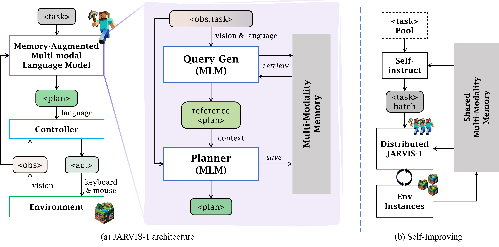
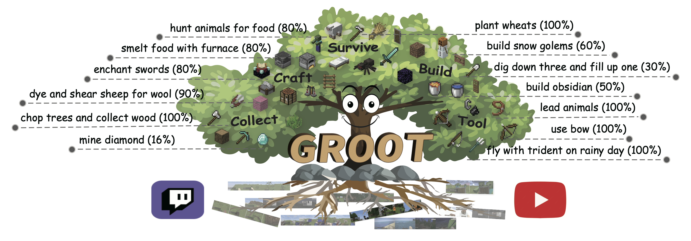
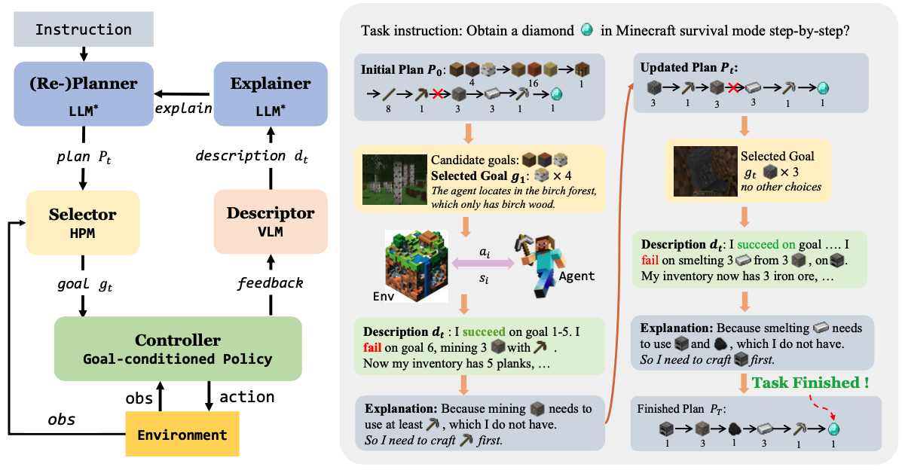

# Welcome to Team CraftJarvis

At CraftJarvis, we're a passionate team committed to exploring the vast potential of AI in the dynamic, open-world environment of Minecraft. Our focus is on developing a generalist agent, an AI entity capable of mastering a wide range of tasks and challenges within this virtual world.

## Publications

Here are a list of our latest publications on Open-world Agents.

### JARVIS-1: Open-world Multi-task Agents with Memory-Augmented Multimodal Language Models

[[Website]](https://craftjarvis.org/JARVIS-1/)
[[Paper]](https://arxiv.org/pdf/2111.05997.pdf)
[[Code]](https://github.com/CraftJarvis/JARVIS-1)

We introduce JARVIS-1, an open-world agent that can perceive multimodal input (visual observations and human instructions), generate sophisticated plans, and perform embodied control, all within the popular yet challenging open-world Minecraft universe. Specifically, we develop JARVIS-1 on top of pre-trained multimodal language models, which map visual observations and textual instructions to plans. The plans will be ultimately dispatched to the goal-conditioned controllers. We outfit JARVIS-1 with a multimodal memory, which facilitates planning using both pre-trained knowledge and its actual game survival experiences. 

### GROOT: Learning to Follow Instructions by Watching Gameplay Videos 

[[Website]](https://craftjarvis.org/GROOT/)
[[Paper]](https://arxiv.org/pdf/2310.08235.pdf)
[[Code]](https://github.com/CraftJarvis/GROOT)

This work proposes to follow reference videos as instructions, which offer expressive goal specifications while eliminating the need for expensive text-gameplay annotations, and implements the agent GROOT in a simple yet effective encoder-decoder architecture based on causal transformers.

### Describe, Explain, Plan and Select: Interactive Planning with Large Language Models Enables Open-World Multi-Task Agents

[[Paper]](https://arxiv.org/pdf/2302.01560.pdf)
[[Code]](https://github.com/CraftJarvis/MC-Planner)

DEPS is an interactive planning approach based on Large Language Models (LLMs) for open-ended multi-task agents. It helps with better error correction from the feedback during the long-haul planning, while also bringing the sense of proximity via goal Selector, a learnable module that ranks parallel sub-goals based on the estimated steps of completion and improves the original plan accordingly.

 